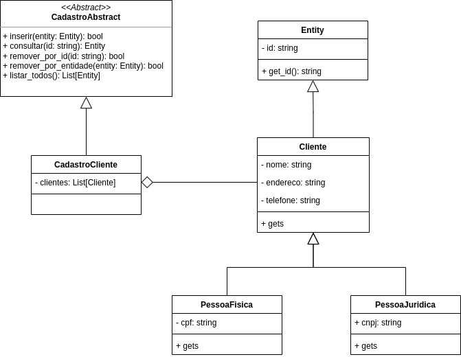

# API REST

Vide <a href="https://github.com/thaifurforo/codigo-s/blob/main/ENCONTRO31-02-06-2022/app.py" target="_blank">app.py</a> e <a href="https://github.com/thaifurforo/codigo-s/blob/main/ENCONTRO31-02-06-2022/teste.py" target="_blank">teste.py</a>

# aluguel-veiculos

## UML 

### Cadastro de clientes

### Cadastro de veiculos

